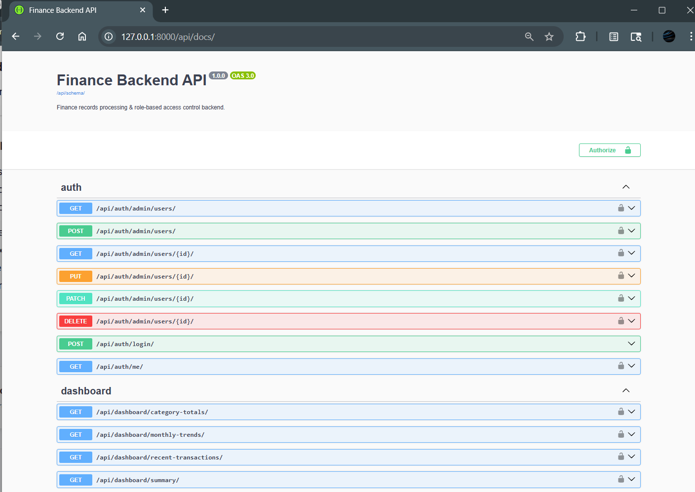
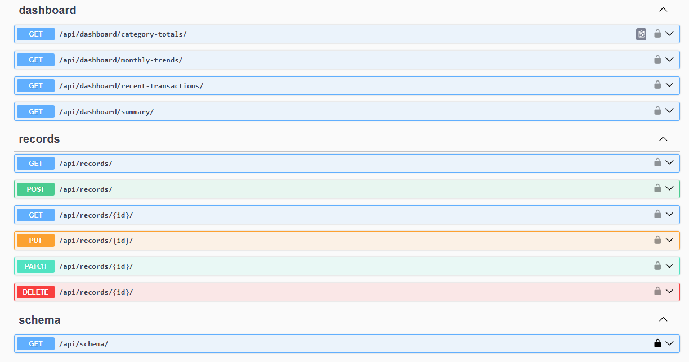
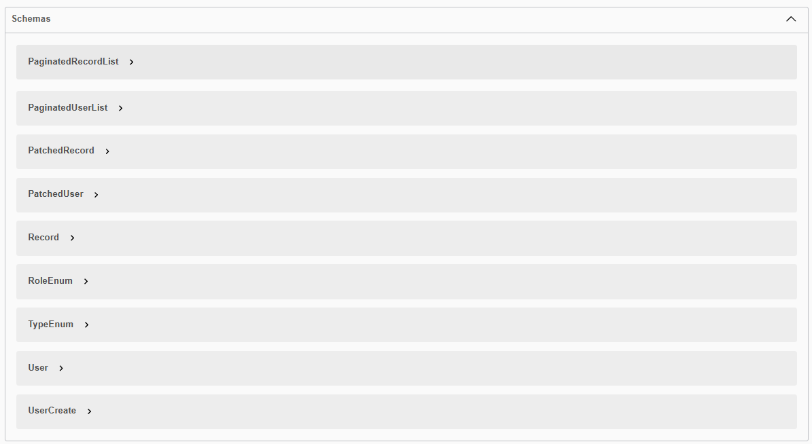

# RBAC Finance API (Django + DRF)

A production-ready backend system for managing financial records and analytics, designed with a modular architecture and scalable service-layer pattern.

Built using Django REST Framework, it implements **role-based access control (RBAC)** and a **service-layer architecture** to ensure scalability, maintainability, and clear separation of concerns.

## 🌐 Live API

> ⚠️ This API is hosted on a free tier and may take ~30–60 seconds to respond on the first request (cold start).

- 🔥 **Interactive API Docs (Swagger):** https://rbac-finance-api.onrender.com/api/docs/  
- 🌍 **Base URL:** https://rbac-finance-api.onrender.com/

## 📸 API Overview
### 🔐 Authentication

<p align="center">
  
</p>

---

### 📊 Dashboard & Records APIs

<p align="center">
  
</p>

---

### 📄 API Schema (Swagger)

<p align="center">
  
</p>

---

## 📁 Project Structure

```
core/
│   constants.py        # Role definitions and shared enums
│   permissions.py      # Reusable role-based access control (RBAC)
│   pagination.py       # Global pagination configuration

users/
│   models.py           # Custom user model with role support
│   views.py            # Authentication & admin-only user management
│   serializers.py      # User-related serializers

records/
│   models.py           # Financial transaction model
│   views.py            # CRUD APIs for records
│   serializers.py      # Record serializers
│   services.py         # Business logic layer (create, update, filters)
│   filters.py          # Query filtering utilities (if applicable)

dashboard/
│   views.py            # Analytics endpoints (summary, trends, totals)
│   serializers.py      # Input/output validation
│   services.py         # Aggregation logic using ORM

finance_backend/
│   settings.py         # Django configuration
│   urls.py             # Root URL routing
│   asgi.py             # ASGI entry point
│   wsgi.py             # WSGI entry point
```

---

## Architecture

### 🔹 Core Layer (`core/`)
Centralized utilities such as permissions, constants, and shared configurations.

### 🔹 User Management (`users/`)
Handles authentication, role assignment, and admin-controlled user operations.

### 🔹 Records Module (`records/`)
Manages financial transactions with a clean separation of concerns using a service layer.

### 🔹 Dashboard Module (`dashboard/`)
Provides analytical insights using optimized ORM queries and aggregations.

### 🔹 Project Configuration (`finance_backend/`)
Contains global settings and application entry points.


## Design Principles

- **Separation of Concerns** → Views, Services, and Models are decoupled  
- **Role-Based Access Control (RBAC)** → Centralized permission system  
- **Service Layer Pattern** → Business logic isolated from views  
- **Modular Architecture** → Easy to extend and maintain 


## Setup

### 1) Install dependencies

```bash
python -m pip install -r requirements.txt
```

### 2) Migrate database

```bash
python manage.py migrate
```

### 3) Create an admin user (optional, recommended)

```bash
python manage.py createsuperuser
```

### 4) Run server

```bash
python manage.py runserver
```

API docs are available at `http://127.0.0.1:8000/api/docs/`.

## Authentication

This project uses **JWT-based authentication**.

Include the access token in request headers:

Authorization: Bearer <access_token>


### Login (Token)

`POST /api/auth/login/`

```json
{ "email": "admin@example.com", "password": "password123" }
```

Response:

```json
{
  "access": "...",
  "refresh": "..."
}
```

### Current user

`GET /api/auth/me/`

## Roles and Access Control

Roles live in `core/constants.py`:

- **Viewer** (`viewer`)
  - Can **GET** records
  - Cannot create/update/delete records
  - No dashboard access
- **Analyst** (`analyst`)
  - Can **GET** records (scoped to their own records)
  - Can access **dashboard** endpoints
  - Cannot create/update/delete records
- **Admin** (`admin`)
  - Full **records CRUD**
  - Full **dashboard** access
  - Admin-only user management APIs

Permissions are enforced by `core/permissions.py` via `RolePermission` + per-view `role_policy`.

## Records API

### Endpoints

- `GET /api/records/` (list; supports filtering & pagination)
- `POST /api/records/` (admin only)
- `GET /api/records/{id}/`
- `PUT/PATCH /api/records/{id}/` (admin only)
- `DELETE /api/records/{id}/` (admin only; **soft delete**)

### Filtering (query params)

- `type=income|expense`
- `category=<string>`
- `date_from=YYYY-MM-DD`
- `date_to=YYYY-MM-DD`

Example:

`GET /api/records/?type=expense&category=food&date_from=2026-01-01&date_to=2026-03-31`

## Dashboard API

- `GET /api/dashboard/summary/`
  - total income, total expense, net balance
- `GET /api/dashboard/category-totals/?type=income|expense` (type optional)
  - category-wise totals (ORM aggregation)
- `GET /api/dashboard/recent-transactions/?limit=10`
  - recent transactions
- `GET /api/dashboard/monthly-trends/`
  - monthly totals grouped by month and type

## Notes and Assumptions

- **Soft delete** is implemented via `records.Record.is_deleted`; list endpoints use `.alive()`.
- Record read access is **scoped**:
  - Admin: sees all records
  - Non-admin: sees only records they created
- SQLite is used for simplicity; models are indexed for common queries.

---

## 👨‍💻 Author

**Avikal Singh**  
Backend Developer (Django | DRF)  

- GitHub: [avikal07](https://github.com/avikal07)
- LinkedIn: [Avikal Singh](https://linkedin.com/in/avikal-singh)
